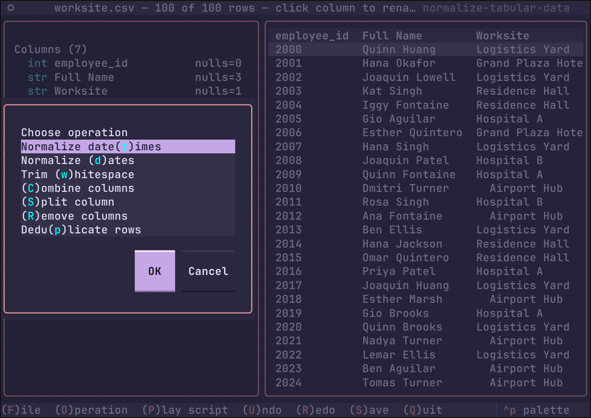

# normalize-tabular-data

A terminal UI (Textual) for interactively normalizing tabular data, backed by
[polars](https://pola.rs) for speed and
[gnosis-date-parser](https://pypi.org/project/gnosis-date-parser/) for fuzzy
date parsing at Rust speed.

Load a file, see a preview, build up a pipeline of normalization operations
(normalize messy dates, trim whitespace, rename a column, deduplicate,
combine/split columns, drop columns), then save the
cleaned result.

## Running

### Persistent install

```bash
uv tool install normalize-tabular-data
# upgrade later with:
uv tool upgrade normalize-tabular-data
```

### Ephemeral run (no install)

`uvx` fetches into a throwaway environment each time:

```bash
uvx normalize-tabular-data
# pin a specific version:
uvx normalize-tabular-data==0.1.0
```

### Straight from a checkout

```bash
uv run normalize-tabular-data
```

### The TestPyPI sandbox

The test build (uploaded via `make testpypi`) is not on PyPI; point uv
at TestPyPI first and PyPI as the fallback index — the tool itself is
found on TestPyPI, its dependencies (`textual`, `polars`, …) on PyPI:

```bash
uvx \
  --index-url https://test.pypi.org/simple/ \
  --extra-index-url https://pypi.org/simple/ \
  normalize-tabular-data==0.1.0

# or installed persistently:
uv tool install \
  --index-url https://test.pypi.org/simple/ \
  --extra-index-url https://pypi.org/simple/ \
  normalize-tabular-data==0.1.0
```

uv caches resolved packages aggressively: after a TestPyPI re-upload of
the same version, add `--refresh-package normalize-tabular-data` so it
re-consults the index rather than reusing the cached artifact.

## Usage

Launch with `normalize-tabular-data`. Keys:

| Key | Action                      |
|-----|-----------------------------|
| `f` | (F)ile — open a file        |
| `o` | (O)peration — choose an op  |
| `p` | (P)lay script — reapply a saved `.ntd` sequence |
| `u` | (U)ndo last applied step    |
| `r` | (R)edo                      |
| `s` | (S)ave the data in a format |
| `q` | (Q)uit                      |

## Operations

- **Normalize dates** — parse a messy date column of *any* input format into
  canonical UTC datetimes; unparseable values become null.
- **Trim whitespace** — strip edges and collapse internal whitespace runs,
  per selected columns.
- Rename a column — click its header in the preview and type the new name.
- **Deduplicate rows** — on all or selected columns, keeping first or last.
- **Combine columns** — concatenate two or more columns with a separator.
- **Split column** — break one column into `{col}_1..{col}_k`; a blank
  delimiter splits on runs of whitespace.
- **Remove columns** — drop selected columns entirely.

## Formats

Reads: CSV, TSV, JSON lines, Parquet, Excel (`.xlsx`/`.xls` — first sheet).
Writes: CSV, TSV, JSON lines, Parquet, Excel (`.xlsx`).

Large files are previewed with a random sample of 250 rows; every operation
still runs on the full data.

## Operation scripts (`.ntd`)

Every open file keeps an internal log of the operations performed on it. When
saving, the dialog offers a **Save sequence of operations?** checkbox
(unticked by default); with it ticked, a second dialog asks where to write
the script — suggested `<table>.ntd`, any other extension you type is kept.

The script is plain ASCII text, one operation per line, e.g.:

```
# normalize-tabular-data script
# source: employees.csv
# table: /data/employees-normalized.csv
# saved: 2026-10-05T12:30:11
trim_collapse(columns=["Dept", "Name"])
date_normalize(column="Hired Date")
```

## Playing a script back

Press `p` (available while a file is loaded) to pick a script file: the
dialog previews the highlighted `.ntd` file (syntax-highlighted, first 40
lines) before you confirm. Its operations are applied, in order, to the table you have open. If any step
cannot be performed against the currently loaded file — a column it
renames, trims or splits is missing, the operation is unknown — playing
stops with an alert naming the failing step, and every step the script had
already applied is rolled back, so the table is left exactly as it was.



## Publishing

PyPI credentials live in `$HOME/.pypirc` (sections `[pypi]` and
`[testpypi]`); uploads go through `twine`, which honors that file —
`uv publish` does not read `.pypirc`, so it is not used here.

```bash
make dist       # build sdist+wheel into dist/ and run `twine check`
make testpypi   # upload to the TestPyPI sandbox (login section [testpypi])
make pypi       # upload to PyPI (login section [pypi])
twine upload    # equivalent of `make pypi`, minus a fresh build
```

The targets fail fast if the package metadata does not pass `twine check`,
and `twine` runs with `--non-interactive` so a missing or wrong
credential aborts the upload instead of prompting mid-run.

## License

BSD 2-Clause. Copyright (c) 2026, Service Employees International Union (SEIU). 

See [LICENSE](LICENSE).
